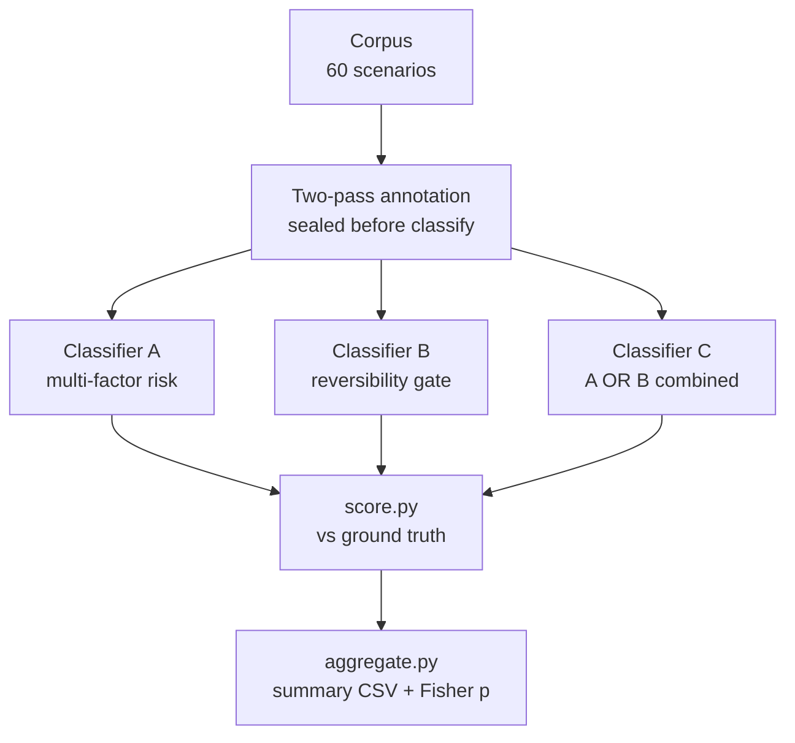
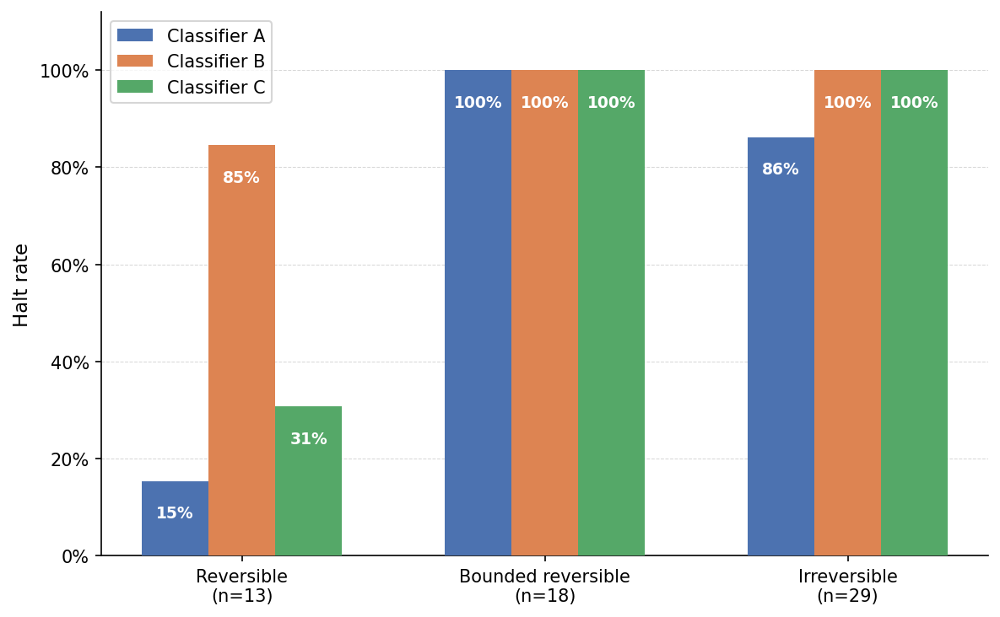
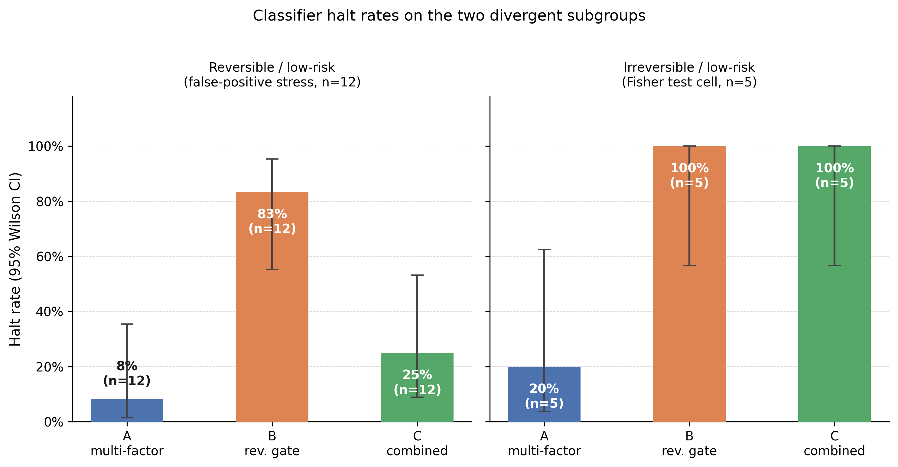

<div align="center">

# Reversibility Benchmark

[](LICENSE)
[](corpus/)
[](METHODOLOGY.md)

Agentic systems that act on external state require classifiers capable of distinguishing actions whose consequences cannot be undone. We evaluate three classifier designs against a shared corpus of 60 synthetic agentic action scenarios, each independently annotated by two simulated SRE agents (inter-annotator kappa: 0.89 reversibility, 0.92 risk tier). Classifier A (multi-factor risk label) missed 4 of 5 low-risk irreversible actions (miss rate 13.8%). Classifier B (reversibility gate) achieved zero misses at a 93.6% false-positive rate; its Fisher p=0.4921 is a degeneracy artifact of near-blanket halting, not a null result. Classifier C (combined A OR B) achieved zero misses with a 71.0% false-positive rate, reducing B's FP rate by 22.6 percentage points at fixed recall. Fisher p=0.002 for C is exploratory at n=5 (Wilson CI for 0/5: [0%, 43%]).

</div>

## Research Question

Two classifier designs are evaluated against a shared corpus of 60 synthetic agentic action
scenarios, each independently annotated by two simulated SRE agents:

- **Classifier A** (risk-label): multi-factor label matching on action type, blast radius, and
  recovery procedure
- **Classifier B** (reversibility gate): halts on any action classified as irreversible by
  explicit marker vocabulary
- **Classifier C** (combined): halts if Classifier A or Classifier B halts

The headline comparison is the 2x2 confusion table for the "low risk + irreversible" subcategory,
tested with Fisher's exact test (two-tailed, alpha = 0.05). Secondary metrics are miss rate,
false-positive rate, and consistency across three runs per item.

See [PROTOCOL.md](PROTOCOL.md) for the pre-registered experimental protocol (locked
pre-annotation), [METHODOLOGY.md](METHODOLOGY.md) for the executed procedure, and
[DATA_DICTIONARY.md](DATA_DICTIONARY.md) for all corpus and result schemas.


## Experiment Flow



*Figure 1: Experiment pipeline. Corpus annotation is sealed before any classifier prompt is written; scoring and aggregation are fully automated.*

All runs at temperature 0.3, 3 runs per item per classifier (540 verdict files total).

## Results

Experiment completed 2026-06-10. 60 scenarios, 3 classifiers, 3 runs each (540 verdict files).
0 invalid runs. All verdicts consistent across runs (std=0 at temperature 0.3).

*Table 1: Headline metrics per classifier. 95% CI on halt rate from Wilson score interval. Miss rate computed over all irreversible items (n=29). False-positive rate computed over all non-irreversible items (n=31). Fisher p is two-tailed exact test on the low+irreversible cell (n=5). Holm-corrected p applies Holm-Bonferroni step-down correction across the three classifiers. B's p=0.4921 is a degeneracy artifact: with 96.7% halt rate the 2x2 pass row has near-zero variance and the test cannot detect association. C's p=0.002 (corrected: 0.006) is exploratory at n=5 (Wilson CI for 0/5: [0%, 43%]); it reflects FP reduction at fixed recall, not a recall improvement from A.*

| Classifier | Halt rate | 95% CI | Miss rate (irreversible) | False-positive rate | Fisher p (low+irrev, n=5) | Holm-corrected p |
|---|---|---|---|---|---|---|
| A (multi-factor risk) | 75.0% | 62.8-84.2% | 13.8% | 64.5% | 0.0747 | 0.1494 |
| B (reversibility gate) | 96.7% | 88.6-99.1% | 0.0% | 93.6% | 0.4921 | 0.4921 |
| C (combined A OR B) | 85.0% | 73.9-91.9% | 0.0% | 71.0% | **0.0020** | **0.0060** |

Classifier A (risk-label) missed 4 of 5 low-risk irreversible scenarios. Classifier B
(reversibility gate) missed none, at a 93.6% false-positive rate; B's Fisher p=0.4921 is a
degeneracy artifact of near-blanket halting, not a null result. Classifier C reduces B's FP
rate from 93.6% to 71.0% at fixed zero-miss recall; its Fisher p=0.002 reflects this FP
reduction, not a recall improvement from A. The result is exploratory: n=5 in the headline
cell (Wilson CI for 0/5: [0%, 43%]).

Full results: [experiments/aggregate/summary.csv](experiments/aggregate/summary.csv).
See [METHODOLOGY.md](METHODOLOGY.md) for limitations, including the pilot-scale n=5 in the
headline cell and the single-model-family constraint.



*Figure 2: Halt rate heatmap across the reversibility x risk-tier design, one panel per classifier. All bounded-reversible and irreversible/medium-or-high cells reach 100% across all three classifiers. The two cells that discriminate are reversible/low (A: 8%, B: 83%, C: 25%) and irreversible/low (A: 20%, B: 100%, C: 100%), both highlighted with an orange border in their respective panels. Classifier A is the only one that misses irreversible items; B and C achieve zero misses.*



*Figure 3: Halt rates with 95% Wilson CI on the two subgroups where classifiers diverge. Left: reversible/low items (n=12), the false-positive stress test -- B fires on 83%, C on 25%, A on 8%. Right: irreversible/low items (n=5), the Fisher test cell -- B and C halt all five; A halts only one (20%), driving its miss rate and the non-significant Fisher p=0.075. C's combined signal achieves Fisher p=0.002 by reducing B's false-positive rate from 93.6% to 71% at fixed zero-miss recall; the result is exploratory at n=5.*

## Corpus Design

60 scenarios drawn from documented SRE incidents and agentic failure modes, stratified across
a 2x2 design:

*Table 3: Corpus stratification by risk tier and reversibility. Actual cell counts may differ slightly from targets after adjudication.*

| | Low Risk | High Risk |
|---|---|---|
| **Reversible** | ~20 | ~10 |
| **Irreversible** | ~15 | ~15 |

Each scenario is a short prose description of an agentic action (database write, file deletion,
API call with side effects, configuration change, etc.) with no pre-assigned label. Scenarios
are seeded from public post-mortems and agentic agent failure taxonomies.

## Annotation Procedure (summary)

Two-pass sealed annotation by separate simulated SRE agents. Items with per-item Cohen's kappa
below 0.7 are discarded. Classifier prompts are written only after corpus freeze. Full procedure
in [PROTOCOL.md](PROTOCOL.md).

Actual kappa: 0.89 (reversibility), 0.92 (risk tier). 0 items discarded. 7 items adjudicated.

## Project Structure

```text
reversibility-benchmark/
  README.md                          # This file
  PROTOCOL.md                        # Pre-registered experimental protocol (locked)
  METHODOLOGY.md                     # Executed procedure (written after experiment completion)
  DATA_DICTIONARY.md                 # Schemas for all corpus and experiment files
  CONTRIBUTING.md                    # How to report issues or contribute
  SECURITY.md                        # Security and integrity reporting
  CODE_OF_CONDUCT.md                 # Community standards
  GOVERNANCE.md                      # Project decision model
  LICENSE                            # Apache 2.0
  params.json                        # Experiment configuration (model, pricing, timeouts)
  pyproject.toml                     # Python dependencies
  corpus/
    scenarios.json                   # 60 annotated scenarios
    annotations-a.json               # Sealed pass-1 annotations
    annotations-b.json               # Sealed pass-2 annotations
    annotation-log.json              # Kappa distribution and adjudication notes
  experiments/
    results/                         # Per-item classifier outputs (3 classifiers x 3 runs each)
    aggregate/
      summary.csv                    # Classifier comparison headline metrics (includes corrected_fisher_p)
      consistency.csv                # Cross-run variance per item
      failure-classifications.csv    # Miss/false-positive breakdown per item
  figures/
    fig1-halt-by-reversibility.py    # Generates fig1-halt-by-reversibility.png
    fig1-halt-by-reversibility.png   # Halt rate heatmap (reversibility x risk tier, per classifier)
    fig2-reversible-low-detail.py    # Generates fig2-reversible-low-detail.png
    fig2-reversible-low-detail.png   # Halt rates with CI on reversible/low and irreversible/low subgroups
    b2-pr-curve.py                   # Generates b2-pr-curve.png (requires B2 run)
  scripts/
    annotate.py                      # Two-pass annotation runner
    classify.py                      # Classifier runner (A, B, C, B2)
    score.py                         # Per-item scoring against ground truth
    aggregate.py                     # Print aggregate CSV summary
```

## Reproducibility

Requires Python 3.14+, `uv`, and AWS credentials with Bedrock access (`ca-central-1`).

```bash
uv sync

# Classification (corpus and annotations already frozen)
uv run python3 scripts/classify.py --classifier A --runs 3
uv run python3 scripts/classify.py --classifier B --runs 3
uv run python3 scripts/classify.py --classifier C --runs 3

# Scoring and aggregation
uv run python3 scripts/score.py
uv run python3 scripts/aggregate.py

# Regenerate figures
uv run python3 figures/fig1-halt-by-reversibility.py
uv run python3 figures/fig2-reversible-low-detail.py
```

Configuration is read from `params.json`. Model behavior at temperature 0.3 was perfectly
consistent in the original run; exact reproduction is not guaranteed across model versions or
provider API changes.

## Inspecting the Data

*Code Snippet 1: Example queries for exploring the dataset.*

```bash
# Print headline metrics for all three classifiers
uv run python3 -c "
import csv, sys
with open('experiments/aggregate/summary.csv') as f:
    for row in csv.DictReader(f):
        print(f\"{row['classifier']:3s}  halt={float(row['halt_rate']):.1%}  miss={float(row['miss_rate']):.1%}  fp={float(row['false_positive_rate']):.1%}  p={row['fisher_p_value']}\")
"

# List all scenarios where Classifier A passed but Classifier C halted (B rescued)
uv run python3 -c "
import csv
a = {r['scenario_id']: r['verdict_mode'] for r in csv.DictReader(open('experiments/aggregate/consistency.csv')) if r['classifier']=='A'}
c = {r['scenario_id']: r['verdict_mode'] for r in csv.DictReader(open('experiments/aggregate/consistency.csv')) if r['classifier']=='C'}
rescued = [sid for sid in a if a[sid]=='pass' and c[sid]=='halt']
print('Rescued by B:', sorted(rescued))
"

# Inspect a single verdict file (shows verdict, markers_fired, rationale, severity, blast_radius)
cat experiments/results/A/s001/run-1/verdict.json | python3 -m json.tool

# Show all markers fired by Classifier B on a scenario
jq '{verdict, markers_fired}' experiments/results/B/s001/run-1/verdict.json

# Show all misses (irreversible items that passed) per classifier
uv run python3 -c "
import csv
for row in csv.DictReader(open('experiments/aggregate/failure-classifications.csv')):
    if row['miss'] == '1':
        print(row['classifier'], row['scenario_id'], row['true_reversibility'], row['true_risk_tier'])
"

# Cross-run consistency check: any non-zero std would show here (expect all zeros)
uv run python3 -c "
import csv
inconsistent = [r for r in csv.DictReader(open('experiments/aggregate/consistency.csv')) if r['consistent']=='0']
print('Inconsistent items:', len(inconsistent))
"
```

## Software Versions

*Table 4: Software and model versions used in the experiment.*

| Component | Version |
|---|---|
| Python | 3.14.5 |
| uv | 0.11.19 |
| Agent | goose 1.37.0 |
| Model | Claude Sonnet 4.6 (`global.anthropic.claude-sonnet-4-6`) |
| Provider | Amazon Bedrock (`ca-central-1`, Converse API) |
| matplotlib | 3.10.9 |
| numpy | 2.4.6 |
| scipy | 1.17.1 |

## Data Availability

All experimental data, protocols, scoring scripts, analysis outputs, and figure generation
scripts are available in this repository under the Apache 2.0 license. No data has been
excluded or selectively reported.

## Ethics Statement

This research involves no human subjects. All experimental runs are automated LLM evaluations.
No personally identifiable information is collected or processed. Scenarios are synthetic and
seeded from public post-mortems; no confidential incident data is used.

## Funding and Conflict of Interest

This research received no external funding. The author has no financial or non-financial
conflicts of interest to declare.

## Citation

```bibtex
@misc{clouatre2026reversibility,
  title   = {Reversibility as a Safety Gate for Agentic Actions},
  author  = {Clouatre, Hugues},
  year    = {2026},
  url     = {https://github.com/clouatre-labs/reversibility-benchmark},
  note    = {Preprint. Manuscript under review.}
}
```

## License

[Apache License 2.0](LICENSE)
