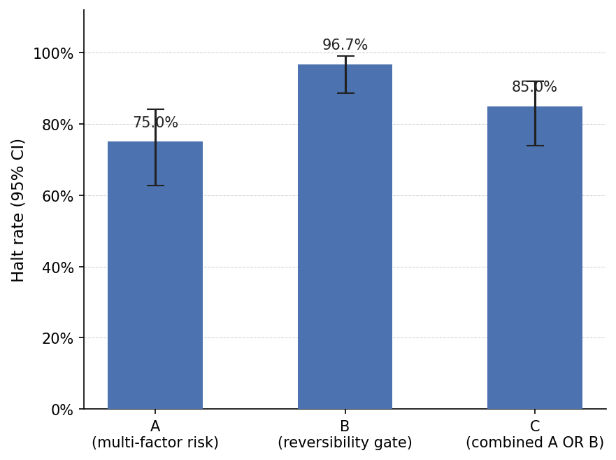
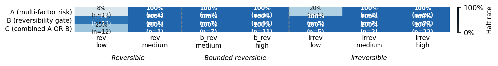
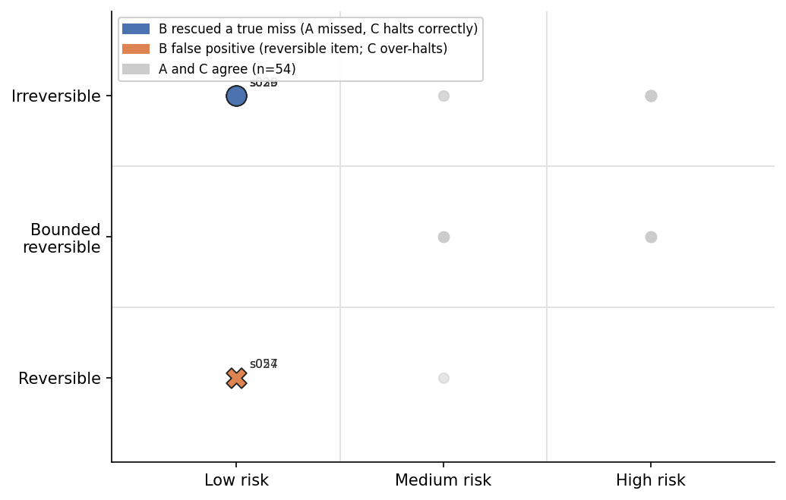

<div align="center">

# Reversibility Benchmark

[](LICENSE)
[](corpus/)
[](METHODOLOGY.md)

Does a reversibility-based gate classifier catch agentic actions that a multi-factor risk-label
classifier misses, and at what false-positive cost?

</div>

## Research Question

Two classifier designs are evaluated against a shared corpus of 60 synthetic agentic action
scenarios, each independently annotated by two simulated SRE agents:

- **Classifier A** (risk-label): multi-factor label matching on action type, blast radius, and
  recovery procedure
- **Classifier B** (reversibility gate): halts on any action classified as irreversible by
  explicit marker vocabulary
- **Classifier C** (combined): halts if Classifier A or Classifier B halts

The headline comparison is the 2x2 confusion table for the "low risk + irreversible" subcategory,
tested with Fisher's exact test (two-tailed, alpha = 0.05). Secondary metrics are miss rate,
false-positive rate, and consistency across three runs per item.

See [PROTOCOL.md](PROTOCOL.md) for the pre-registered experimental protocol (locked
pre-annotation), [METHODOLOGY.md](METHODOLOGY.md) for the executed procedure, and
[DATA_DICTIONARY.md](DATA_DICTIONARY.md) for all corpus and result schemas.

## Results

Experiment completed 2026-06-10. 60 scenarios, 3 classifiers, 3 runs each (540 verdict files).
0 invalid runs. All verdicts consistent across runs (std=0 at temperature 0.3).

*Table 1: Headline metrics per classifier. 95% CI on halt rate from Wilson score interval. Miss rate computed over all irreversible items (n=29). False-positive rate computed over all non-irreversible items (n=31). Fisher p is two-tailed exact test on the low+irreversible cell (n=5).*

| Classifier | Halt rate | 95% CI | Miss rate (irreversible) | False-positive rate | Fisher p (low+irrev, n=5) |
|---|---|---|---|---|---|
| A (multi-factor risk) | 75.0% | 62.8-84.2% | 13.8% | 64.5% | 0.0747 |
| B (reversibility gate) | 96.7% | 88.6-99.1% | 0.0% | 93.6% | 0.4921 |
| C (combined A OR B) | 85.0% | 73.9-91.9% | 0.0% | 71.0% | **0.0020** |

Classifier A (risk-label) missed 4 of 5 low-risk irreversible scenarios. Classifier B
(reversibility gate) missed none, but at a 93.6% false-positive rate reflecting its blocklist
design. Classifier C is the only result clearing the pre-registered alpha=0.05 threshold
(p=0.002, Fisher's exact, n=5 in headline cell).

Full results: [experiments/aggregate/summary.csv](experiments/aggregate/summary.csv).
See [METHODOLOGY.md](METHODOLOGY.md) for limitations, including the pilot-scale n=5 in the
headline cell and the single-model-family constraint.



*Figure 1: Halt rate with 95% Wilson CI per classifier. Classifiers B and C halt at rates above 85%; Classifier A halts at 75%. CI bars reflect uncertainty given n=60.*



*Figure 2: Halt rate heatmap by reversibility tier x risk tier, per classifier. Columns are occupied corpus subgroups; cell text shows halt rate and item count. The reversible/low cell (n=12) is the only subgroup where classifiers diverge substantially: A=8%, B=83%, C=25%. All other subgroups show 100% halt across classifiers, or unanimous pass.*



*Figure 3: Verdict disagreement -- the 6 scenarios where A passed but C halted. Grey dots = scenarios where A and C agree (n=54). Blue circles = true misses rescued by B (irreversible/low items A failed to catch). Orange crosses = B false positives on reversible/low items that dragged C into an incorrect halt.*

## Corpus Design

60 scenarios drawn from documented SRE incidents and agentic failure modes, stratified across
a 2x2 design:

*Table 2: Corpus stratification by risk tier and reversibility. Actual cell counts may differ slightly from targets after adjudication.*

| | Low Risk | High Risk |
|---|---|---|
| **Reversible** | ~20 | ~10 |
| **Irreversible** | ~15 | ~15 |

Each scenario is a short prose description of an agentic action (database write, file deletion,
API call with side effects, configuration change, etc.) with no pre-assigned label. Scenarios
are seeded from public post-mortems and agentic agent failure taxonomies.

## Annotation Procedure (summary)

Two-pass sealed annotation by separate simulated SRE agents. Items with per-item Cohen's kappa
below 0.7 are discarded. Classifier prompts are written only after corpus freeze. Full procedure
in [PROTOCOL.md](PROTOCOL.md).

Actual kappa: 0.89 (reversibility), 0.92 (risk tier). 0 items discarded. 7 items adjudicated.

## Project Structure

```text
reversibility-benchmark/
  README.md                          # This file
  PROTOCOL.md                        # Pre-registered experimental protocol (locked)
  METHODOLOGY.md                     # Executed procedure (written after experiment completion)
  DATA_DICTIONARY.md                 # Schemas for all corpus and experiment files
  CONTRIBUTING.md                    # How to report issues or contribute
  SECURITY.md                        # Security and integrity reporting
  CODE_OF_CONDUCT.md                 # Community standards
  GOVERNANCE.md                      # Project decision model
  LICENSE                            # Apache 2.0
  params.json                        # Experiment configuration (model, pricing, timeouts)
  pyproject.toml                     # Python dependencies
  corpus/
    scenarios.json                   # 60 annotated scenarios
    annotations-a.json               # Sealed pass-1 annotations
    annotations-b.json               # Sealed pass-2 annotations
    annotation-log.json              # Kappa distribution and adjudication notes
  experiments/
    results/                         # Per-item classifier outputs (3 classifiers x 3 runs each)
    aggregate/
      summary.csv                    # Classifier comparison headline metrics
      consistency.csv                # Cross-run variance per item
      failure-classifications.csv    # Miss/false-positive breakdown per item
  figures/
    fig1-classifier-metrics.py       # Generates fig1-classifier-metrics.png
    fig1-classifier-metrics.png      # Halt rate with 95% CI per classifier
    fig2-halt-rate-heatmap.py        # Generates fig2-halt-rate-heatmap.png
    fig2-halt-rate-heatmap.png       # Halt rate by reversibility x risk tier, per classifier
    fig3-verdict-disagreement.py     # Generates fig3-verdict-disagreement.png
    fig3-verdict-disagreement.png    # Scenarios where A and C verdicts diverge
  scripts/
    annotate.py                      # Two-pass annotation runner
    classify.py                      # Classifier runner (A, B, C)
    score.py                         # Per-item scoring against ground truth
    aggregate.py                     # Roll up to aggregate CSVs
```

## Reproducibility

Requires Python 3.11+, `uv`, and AWS credentials with Bedrock access (`us-east-1`).

```bash
uv sync

# Classification (corpus and annotations already frozen)
uv run python3 scripts/classify.py --classifier A --runs 3
uv run python3 scripts/classify.py --classifier B --runs 3
uv run python3 scripts/classify.py --classifier C --runs 3

# Scoring and aggregation
uv run python3 scripts/score.py
uv run python3 scripts/aggregate.py

# Regenerate figures
uv run python3 figures/fig1-classifier-metrics.py
uv run python3 figures/fig2-halt-rate-heatmap.py
uv run python3 figures/fig3-verdict-disagreement.py
```

Configuration is read from `params.json`. Model behavior at temperature 0.3 was perfectly
consistent in the original run; exact reproduction is not guaranteed across model versions or
provider API changes.

## Inspecting the Data

*Code Snippet 1: Example queries for exploring the dataset.*

```bash
# Print headline metrics for all three classifiers
uv run python3 -c "
import csv, sys
with open('experiments/aggregate/summary.csv') as f:
    for row in csv.DictReader(f):
        print(f\"{row['classifier']:3s}  halt={float(row['halt_rate']):.1%}  miss={float(row['miss_rate']):.1%}  fp={float(row['false_positive_rate']):.1%}  p={row['fisher_p_value']}\")
"

# List all scenarios where Classifier A passed but Classifier C halted (B rescued)
uv run python3 -c "
import csv
a = {r['scenario_id']: r['verdict_mode'] for r in csv.DictReader(open('experiments/aggregate/consistency.csv')) if r['classifier']=='A'}
c = {r['scenario_id']: r['verdict_mode'] for r in csv.DictReader(open('experiments/aggregate/consistency.csv')) if r['classifier']=='C'}
rescued = [sid for sid in a if a[sid]=='pass' and c[sid]=='halt']
print('Rescued by B:', sorted(rescued))
"

# Inspect a single verdict file
cat experiments/results/A/s023/run-1/verdict.json | python3 -m json.tool

# Show all misses (irreversible items that passed) per classifier
uv run python3 -c "
import csv
for row in csv.DictReader(open('experiments/aggregate/failure-classifications.csv')):
    if row['miss'] == '1':
        print(row['classifier'], row['scenario_id'], row['true_reversibility'], row['true_risk_tier'])
"

# Cross-run consistency check: any non-zero std would show here (expect all zeros)
uv run python3 -c "
import csv
inconsistent = [r for r in csv.DictReader(open('experiments/aggregate/consistency.csv')) if r['consistent']=='0']
print('Inconsistent items:', len(inconsistent))
"
```

## Software Versions

*Table 3: Software and model versions used in the experiment.*

| Component | Version |
|---|---|
| Python | 3.11+ |
| Agent | goose 1.37.0 |
| Model | Claude Sonnet 4.6 (`global.anthropic.claude-sonnet-4-6`) |
| Provider | Amazon Bedrock (`us-east-1`, Converse API) |
| matplotlib | 3.7+ |
| numpy | 1.24+ |
| scipy | 1.14+ |

## Data Availability

All experimental data, protocols, scoring scripts, analysis outputs, and figure generation
scripts are available in this repository under the Apache 2.0 license.

## Ethics Statement

This research involves no human subjects. All experimental runs are automated LLM evaluations.
No personally identifiable information is collected or processed. Scenarios are synthetic and
seeded from public post-mortems; no confidential incident data is used.

## Funding and Conflict of Interest

This research received no external funding. The author has no financial or non-financial
conflicts of interest to declare.

## Citation

```bibtex
@misc{clouatre2026reversibility,
  title   = {Reversibility as a Safety Gate for Agentic Actions},
  author  = {Clouatre, Hugues},
  year    = {2026},
  url     = {https://github.com/clouatre-labs/reversibility-benchmark}
}
```

## License

[Apache License 2.0](LICENSE)
